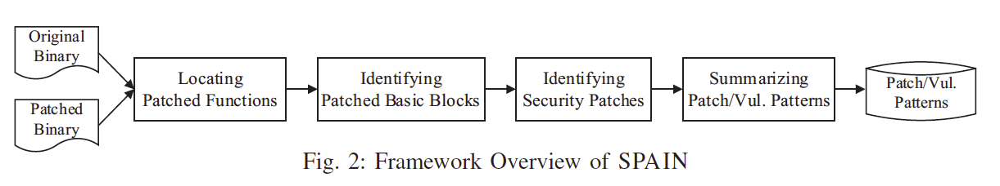

# bindiff-research
The purpose of this repo is to collect and summarize some binary-diffing related literature reviews and the results of the observation on binary difference. It would be more close to patch analysis so that we would focus on comparing unpatched and patched binaries.  

The summary in this repo **should not be enough** for you to understand the details of paper, but would help you to feel interested in it.

## Literature review
The format would be sorted in ascending order on published year or month. The content should include goal, assumption, contribution, future work, and the core idea (some techniques can be included but not all details) of the paper.

### Cross-Architecture Binary Semantics Understanding via Similar Code Comparison (SANER 16)
* Goal: Semantic-based Binary Code Similarity. Given specific function in template binary, locate the most similar one in target binary (This work is later used by BINPATCH[2] to locate defective function) Target binary would be same code base with different architectures or different optimization level.
* Core idea: Semantic-similar functions are executed with the same input, the possibility that observed behaviors are similar is high. Based on VEX-IR, two dynamic features (COP + SCA) which can be less influenced by the implementation variance or instruction set difference.
  * Comparison Operand Pairs (COP): a pair of operand **values** belonging to comparison instruction which can decides the following control flow.
  * System Call Attributes (SCA): contains name of syscall and arguments. e.g. `("sys_write", Hash("1, tag, 10"))` (I would explain the tag in normalization part later).
  * Normalization: Of course some type of concrete values are not meaningful. (1) Pointer abstraction because the value of memory address is not important. Same memory address share the same tag. (2) Canary Removal because the comparison operation for canary is not important. (3) Boundary Unification because some comparison are same actually even though with different operators (4) Loop Compression because execution trace of loop body would be large.
  * Sequence similarity comparison: Longest Common Subsequence to get Jaccard Index (what's interesting is that how they filter out something not need to be checked before comparison)
* Limitation:
  * function inline on x86: which would insert junk data to other functions
  * float point number porocessing on x86: float number processing would work on FPU stack, which would include condition comparisons and make COP feature confused.
  * how if function is short of conditional comparison.
  * how to construct input
* Future work
  * To construct input, try concolic execution and fuzzing testing.
  * For efficient sequence comparison, adopt MinHash which could estimate Jaccard Index quickly.

Reference: 
1. https://ieeexplore.ieee.org/document/7476630
2. https://ieeexplore.ieee.org/document/8653831

### SPAIN: Security Patch Analysis for Binaries Towards Understanding the Pain and Pills (ICSE 2017)
* Goal: a scalable binary-level patch analysis framework which can automatically identify security patches and summarize patch patterns and their corresponding vulnerability patterns.  
* Assumtion: patch would change only single function, the results of IDA pro and Bindiff would be accurate   
* Core idea:
  * Locate patched function: 1) Make initial function pairs with function name(not stripped)/Bindiff(stripped). 2) Make more filtering on pairs based on 3D-CFG hashing techniques(`<unique prime num of bb, num of outgoing edges, loop depth>`).  
  * Identify patched basic block: In this step will also map the patched trace to original trace. 1) Leverage pairwise basic block matching(based on normalized basic block?), then the rest of basic blocks which have no matching should be patched basic block. 2) To determine relationships among patched basic block, connect them if patched basic block is successor/predecessor to each other, now we have a patched partial trace. 3) For each bb in patched partial trace, identify unmodified first-degree neighbor from original function, this helps to locate the patch.  
  * Identify security patches: Generate semantic summary from partial trace. The semantic summary is the difference between pre-state and post-state. If it is below a pre-defined threshold, then determine it as a security patch.  
  * Summarize patch and vul pattern: Given patched partial trace, combine taint source, taint sink, and sanity checks as patch pattern. Taint source and taint sink would be vulnerability pattern.    
* Future work:  

### Similarity of Binaries through re-Optimization (PLDI 17)
* Goal: establish similarity of binary, which is complication-process-agnostic (different compiler, optimization level, and architectures)
* Core idea:
  * lift the binary code / assembly code into IR code (LLVM-IR).
  * Fragment procedures to comparable units (strands), which is data-flow slices of basic blocks.
  * Canonicalize strands at IR level. 
    * revert the lifter-imposed changes
    * simplify the expression of instruction patterns (e.g., mov, add --> add)
  * Normalize form. 
    * immaterialize the specific name of the register
    * renumber or remove the temporary values
  * Scalable search using hashed canonical strands. 
    * Hashing of the textual representation of the strands
  * Determine the statistical significance of a strand.

> By Xu He. Canonicalization and normalization is used to eliminate the impact of compilation process.

### PatchScope: Memory Object Centric Patch Diffing (CCS 20)
* Goal: A new way of patch diffing to make insight of patch details and fixed vulnerabilities (memory corruption based).  
* Assumption: Given PoC  
* Core idea:
  * Compare **memory object access sequence(MOAS)** to understand the details of patch more concisely than difference at assembly-level  
* Future work:  

PatchScope mentioned some interesting comparison on existing work for binary diff:  
| Syntax-based | Symbolic execution | Semantics-aware |
| ---         |     ---     |          --- |
| Small code changes cannot be detected while large diff include a lot of irrelevant content. Briefly speaking, it would raise a lot of false positives.   | Can start from source code level or binary level. Leverage static analysis to locate patched function because it works within basic block.     | Identify system calls or API calls to represent program semantics, but it would be so coarse-grained because small code changes with security patches.    |
| Dynamic Execution can filter irrelative code changes. However, it would possibly result in more instructions and cannot help understanding.     | The output of symbolic execution is hard for understanding the patch.       | Or using dynamic testing to compare behaviors for similarity measurement.      |

> By Rafael. Cool! But without source code to prove implementation.

## Personal Summary by Rafael
### For static analysis
We would need to figure out the stuff in binary-level, recover semantics information. 

### For dynamic analysis
It's easy for us to trace the behavior (semantics) of program. However, the code size in trace would be larger if you can not identify the behavior accurately. For example, if you trace loop dynamically, the code size would be multiple of original one. In this way, you would need to identify this is a loop behavior.

