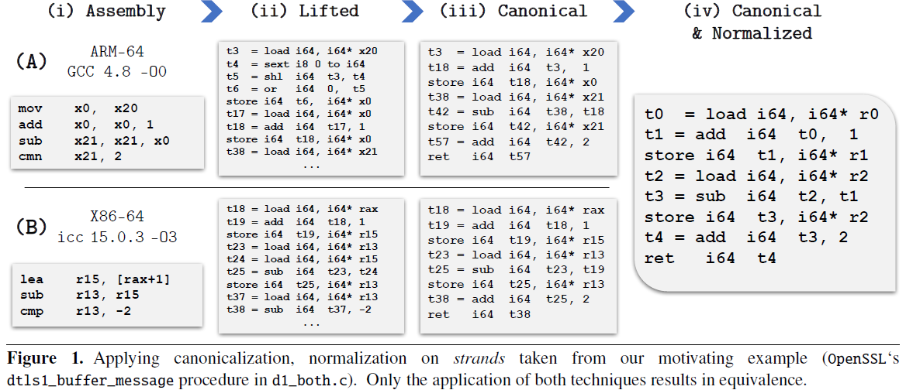

# bindiff-research
The purpose of this repo is to collect and summarize some binary-diffing related literature reviews and the results of the observation on binary difference. It would be more close to patch analysis so that we would focus on comparing unpatched and patched binaries.  

The summary in this repo **should not be enough** for you to understand the details of paper, but would help you to feel interested in it.

## Literature review
The format would be sorted in ascending order on published year or month. The content should include goal, assumption, contribution, future work, and the core idea (some techniques can be included but not all details) of the paper.

### SPAIN: Security Patch Analysis for Binaries Towards Understanding the Pain and Pills (ICSE 2017)
* Goal: a scalable binary-level patch analysis framework which can automatically identify security patches and summarize patch patterns and their corresponding vulnerability patterns.  
* Assumtion: patch would change only single function, the results of IDA pro and Bindiff would be accurate   
* Core idea:
  * Locate patched function: 1) Make initial function pairs with function name(not stripped)/Bindiff(stripped). 2) Make more filtering on pairs based on 3D-CFG hashing techniques(`<unique prime num of bb, num of outgoing edges, loop depth>`).  
  * Identify patched basic block: In this step will also map the patched trace to original trace. 1) Leverage pairwise basic block matching(based on normalized basic block?), then the rest of basic blocks which have no matching should be patched basic block. 2) To determine relationships among patched basic block, connect them if patched basic block is successor/predecessor to each other, now we have a patched partial trace. 3) For each bb in patched partial trace, identify unmodified first-degree neighbor from original function, this helps to locate the patch.  
  * Identify security patches: Generate semantic summary from partial trace. The semantic summary is the difference between pre-state and post-state. If it is below a pre-defined threshold, then determine it as a security patch.  
  * Summarize patch and vul pattern: Given patched partial trace, combine taint source, taint sink, and sanity checks as patch pattern. Taint source and taint sink would be vulnerability pattern.    
* Future work:  

### PatchScope: Memory Object Centric Patch Diffing (CCS 20)
* Goal: A new way of patch diffing to make insight of patch details and fixed vulnerabilities (memory corruption based).  
* Assumption: Given PoC  
* Core idea:
  * Compare **memory object access sequence(MOAS)** to understand the details of patch more concisely than difference at assembly-level  
* Future work:  

> By Rafael. Cool! But without source code to prove implementation.

# Binary Analysis Research
This is the draft for the repo (bindiff-research) on GitHub, maintained by Rafael Chen & Xu He.
## Literature review
### Similarity of Binaries through re-Optimization (PLDI 17)
* Goal: establish similarity of binary, which is complication-process-agnostic (different compiler, optimization level, and architectures)

* Core idea:
  * lift the binary code / assembly code into IR code (LLVM-IR).
  * Fragment procedures to comparable units (strands), which is data-flow slices of basic blocks.
  * Canonicalize strands at IR level. 
    * revert the lifter-imposed changes
    * simplify the expression of instruction patterns (e.g., mov, add --> add)
  * Normalize form. 
    * immaterialize the specific name of the register
    * renumber or remove the temporary values
  * Scalable search using hashed canonical strands. 
    * Hashing of the textual representation of the strands
  * Determine the statistical significance of a strand.

>Canonicalization and normalization is used to eliminate the impact of compilation process.
